# 📊 MODELO ENTIDAD-RELACIÓN (MER / DER) — ACADEMIX
## Sistema Integral de Gestión Académica y Control Escolar

> **Evidencia de Aprendizaje:** Creación de la base de datos en el motor seleccionado según especificaciones técnicas del informe y protocolos de la empresa.  
> **Programa:** Análisis y Desarrollo de Software (ADSO / ADSI - SENA)  
> **Motor de Base de Datos Seleccionado:** MySQL 8.0 / MariaDB (Motor de Almacenamiento InnoDB con soporte ACID)  
> **Codificación:** UTF-8 Unicode (`utf8mb4_unicode_ci`)  
> **Fecha:** Septiembre 2026  

---

## 1. INTRODUCCIÓN Y CONTEXTO DEL MODELO

El **Modelo Entidad-Relación (MER)** de **ACADEMIX** ha sido diseñado bajo los principios de la **Tercera Forma Normal (3FN)**, eliminando redundancias, anomalías de inserción, actualización o borrado, y garantizando la total consistencia de la información institucional.

El modelo soporta el ciclo de vida escolar completo:
1. **Seguridad y Trazabilidad:** Usuarios con 6 roles diferenciados, sesiones y auditoría forense inmutable.
2. **Estructura Curricular:** Años lectivos, grados, cursos/secciones, áreas de conocimiento y asignaturas con intensidad horaria.
3. **Gestión de Personal y Estudiantes:** Ficha docente, expediente estudiantil, vinculación de acudientes y matrículas formales.
4. **Operación Académica:** Sesiones de asistencia con semáforo preventivo, tareas escolares con entregas digitales, y calificaciones estructuradas en componentes porcentuales con precisión matemática decimal.
5. **Cierre y Promoción:** Consolidación de periodos, boletines conforme al Decreto 1290 y cierre anual transaccional.

---

## 2. DIAGRAMA ENTIDAD-RELACIÓN (MER / DER)

```mermaid
erDiagram
    %% ========================================================
    %% MÓDULO DE USUARIOS Y ROLES
    %% ========================================================
    CUSTOM_USER {
        int id PK
        string username
        string password
        string email
        string first_name
        string last_name
        string role
        string document_type
        string document_number
        string phone
        string address
        boolean is_active
        boolean is_staff
        boolean is_superuser
        datetime created_at
    }

    STUDENT_PROFILE {
        int id PK
        int user_id FK
        string student_code
        string medical_info
        date birth_date
        string guardian_phone
    }

    TEACHER_PROFILE {
        int id PK
        int user_id FK
        string professional_title
        string specialty
        string institutional_phone
    }

    %% ========================================================
    %% MÓDULO CURRICULAR Y ESTRUCTURA ACADÉMICA
    %% ========================================================
    ACADEMIC_YEAR {
        int id PK
        int year
        boolean is_active
        date start_date
        date end_date
    }

    GRADE_LEVEL {
        int id PK
        string name
        int order_index
        string description
    }

    COURSE_SECTION {
        int id PK
        string name
        int capacity
        int grade_level_id FK
        int academic_year_id FK
    }

    KNOWLEDGE_AREA {
        int id PK
        string name
        string code
    }

    SUBJECT {
        int id PK
        string name
        string code
        int knowledge_area_id FK
    }

    GRADE_SUBJECT {
        int id PK
        int grade_level_id FK
        int subject_id FK
        int weekly_hours
    }

    ACADEMIC_PERIOD {
        int id PK
        string name
        int period_number
        decimal weight_percentage
        string status
        int academic_year_id FK
    }

    TEACHING_ASSIGNMENT {
        int id PK
        int teacher_id FK
        int course_section_id FK
        int subject_id FK
        int academic_year_id FK
    }

    %% ========================================================
    %% MÓDULO DE MATRÍCULAS Y SEGUIMIENTO
    %% ========================================================
    ENROLLMENT {
        int id PK
        int student_id FK
        int course_section_id FK
        int academic_year_id FK
        date enrollment_date
        string status
    }

    ATTENDANCE_SESSION {
        int id PK
        int course_section_id FK
        int subject_id FK
        int teacher_id FK
        date session_date
        string time_slot
    }

    ATTENDANCE_RECORD {
        int id PK
        int session_id FK
        int student_id FK
        string status
        string remarks
    }

    %% ========================================================
    %% MÓDULO DE CALIFICACIONES Y TAREAS
    %% ========================================================
    EVALUATION_CRITERION {
        int id PK
        string name
        string dimension
        decimal percentage
        int subject_id FK
        int period_id FK
    }

    GRADE_RECORD {
        int id PK
        int student_id FK
        int evaluation_criterion_id FK
        decimal score
        datetime graded_at
    }

    PERIOD_FINAL_GRADE {
        int id PK
        int student_id FK
        int course_section_id FK
        int subject_id FK
        int academic_period_id FK
        decimal final_score
        string performance_level
        boolean is_approved
    }

    HOMEWORK {
        int id PK
        string title
        text description
        datetime due_date
        int assignment_id FK
        string attachment_url
    }

    HOMEWORK_SUBMISSION {
        int id PK
        int homework_id FK
        int student_id FK
        text submission_text
        string attachment_url
        datetime submitted_at
        decimal score
        text feedback
    }

    %% ========================================================
    %% MÓDULO DE AUDITORÍA FORENSE
    %% ========================================================
    AUDIT_LOG {
        int id PK
        int user_id FK
        string action
        string target_model
        string target_id
        longtext changes_json
        string ip_address
        datetime timestamp
    }

    %% ========================================================
    %% RELACIONES ENTRE ENTIDADES
    %% ========================================================
    CUSTOM_USER ||--o| STUDENT_PROFILE : "1 a 1 (Perfil Estudiante)"
    CUSTOM_USER ||--o| TEACHER_PROFILE : "1 a 1 (Perfil Docente)"
    CUSTOM_USER ||--o{ AUDIT_LOG : "1 a N (Genera eventos)"

    ACADEMIC_YEAR ||--o{ COURSE_SECTION : "1 a N (Agrupa cursos)"
    ACADEMIC_YEAR ||--o{ ACADEMIC_PERIOD : "1 a N (Se divide en periodos)"
    ACADEMIC_YEAR ||--o{ ENROLLMENT : "1 a N (Vigencia de matricula)"

    GRADE_LEVEL ||--o{ COURSE_SECTION : "1 a N (Tiene grupos A, B)"
    GRADE_LEVEL ||--o{ GRADE_SUBJECT : "1 a N (Malla por grado)"

    KNOWLEDGE_AREA ||--o{ SUBJECT : "1 a N (Agrupa materias)"
    SUBJECT ||--o{ GRADE_SUBJECT : "1 a N (Configuracion horaria)"

    TEACHER_PROFILE ||--o{ TEACHING_ASSIGNMENT : "1 a N (Carga docente)"
    COURSE_SECTION ||--o{ TEACHING_ASSIGNMENT : "1 a N (Horario de curso)"
    SUBJECT ||--o{ TEACHING_ASSIGNMENT : "1 a N (Materia dictada)"

    STUDENT_PROFILE ||--o{ ENROLLMENT : "1 a N (Historial matriculas)"
    COURSE_SECTION ||--o{ ENROLLMENT : "1 a N (Estudiantes del curso)"

    COURSE_SECTION ||--o{ ATTENDANCE_SESSION : "1 a N (Llamados de lista)"
    ATTENDANCE_SESSION ||--o{ ATTENDANCE_RECORD : "1 a N (Detalle por alumno)"
    STUDENT_PROFILE ||--o{ ATTENDANCE_RECORD : "1 a N (Registro de fallas)"

    SUBJECT ||--o{ EVALUATION_CRITERION : "1 a N (Dimensiones 40-40-20)"
    ACADEMIC_PERIOD ||--o{ EVALUATION_CRITERION : "1 a N (Criterios del periodo)"
    EVALUATION_CRITERION ||--o{ GRADE_RECORD : "1 a N (Notas parciales)"
    STUDENT_PROFILE ||--o{ GRADE_RECORD : "1 a N (Calificaciones alumno)"

    STUDENT_PROFILE ||--o{ PERIOD_FINAL_GRADE : "1 a N (Definitivas periodo)"
    SUBJECT ||--o{ PERIOD_FINAL_GRADE : "1 a N (Nota por materia)"
    ACADEMIC_PERIOD ||--o{ PERIOD_FINAL_GRADE : "1 a N (Cierre periodo)"

    TEACHING_ASSIGNMENT ||--o{ HOMEWORK : "1 a N (Tareas publicadas)"
    HOMEWORK ||--o{ HOMEWORK_SUBMISSION : "1 a N (Entregas digitales)"
    STUDENT_PROFILE ||--o{ HOMEWORK_SUBMISSION : "1 a N (Envios del alumno)"
```

---

## 3. DESCRIPCIÓN DE ENTIDADES Y CARDINALIDADES

### 3.1 Módulo Central de Autenticación y Seguridad
* **`CUSTOM_USER`:** Entidad central que hereda del núcleo de seguridad de Django. Gestiona credenciales seguras (hasheadas en PBKDF2), datos personales básicos y el rol institucional (`ADMIN`, `RECTOR`, `SECRETARIA`, `TEACHER`, `STUDENT`, `PARENT`).
* **`STUDENT_PROFILE` (1 a 1 con `CUSTOM_USER`):** Almacena metadatos propios del estudiante (código institucional, fecha de nacimiento, datos médicos, teléfono de contacto).
* **`TEACHER_PROFILE` (1 a 1 con `CUSTOM_USER`):** Almacena especialidad, escalafón docente y título profesional.
* **`AUDIT_LOG` (N a 1 con `CUSTOM_USER`):** Registro inmutable para trazabilidad forense según normas ISO 27001. Captura IP, acción (`CREATE`, `UPDATE`, `DELETE`, `LOGIN`), cambios en JSON y marca de tiempo.

### 3.2 Módulo de Estructura Curricular
* **`ACADEMIC_YEAR`:** Define el año calendario escolar vigente (ej. 2026). Controla la apertura y cierre oficial del ciclo lectivo.
* **`GRADE_LEVEL`:** Grados académicos de la institución (6° a 11°).
* **`COURSE_SECTION` (N a 1 con `GRADE_LEVEL` y `ACADEMIC_YEAR`):** Salones o grupos físicos (ej. 6-A, 6-B, 10-A) con límite de cupo.
* **`KNOWLEDGE_AREA` y `SUBJECT` (1 a N):** Áreas fundamentales (Matemáticas, Humanidades, Ciencias) y sus materias específicas (Álgebra, Geometría, Español).
* **`TEACHING_ASSIGNMENT`:** Tabla asociativa ternaria que formaliza qué docente imparte qué asignatura a qué curso específico durante el año lectivo.

### 3.3 Módulo de Operación Diaria: Asistencia y Calificaciones
* **`ENROLLMENT`:** Formalización de la matrícula del estudiante en un curso determinado para el año lectivo.
* **`ATTENDANCE_SESSION` y `ATTENDANCE_RECORD` (1 a N):** Encabezado de la clase y detalle individual del llamado de lista (Presente, Falta Justificada, Falta Injustificada, Retardo) para alimentar el semáforo preventivo.
* **`EVALUATION_CRITERION` y `GRADE_RECORD`:** Matriz de notas dividida en dimensiones (Cognitivo 40%, Procedimental 40%, Actitudinal 20%) con notas de tipo `Decimal(5,2)`.
* **`PERIOD_FINAL_GRADE`:** Tabla calculada transaccionalmente que consolida la nota final del periodo con base en el Decreto 1290 (Superior, Alto, Básico, Bajo).
* **`HOMEWORK` y `HOMEWORK_SUBMISSION`:** Publicación de asignaciones escolares con fecha de vencimiento y carga de entregas digitales por los alumnos.

---

## 4. NORMALIZACIÓN Y REGLAS DE INTEGRIDAD

1. **Primera Forma Normal (1FN):** Todos los campos son atómicos. No existen listas ni arrays embebidos en campos de texto (las relaciones muchos a muchos usan tablas intermedias).
2. **Segunda Forma Normal (2FN):** Todas las columnas que no son clave dependen por completo de la clave primaria.
3. **Tercera Forma Normal (3FN):** No existen dependencias transitivas; las notas consolidadas de periodo dependen exclusivamente de la clave foránea del alumno, la materia y el periodo respectivo.
4. **Integridad Referencial:**
   - Llaves foráneas con restricción `ON DELETE CASCADE` en detalles dependientes (ej. si se borra una sesión de asistencia, se eliminan sus registros).
   - Llaves foráneas con restricción `ON DELETE PROTECT` en entidades críticas (ej. no se puede borrar un curso si tiene alumnos matriculados o notas registradas).
