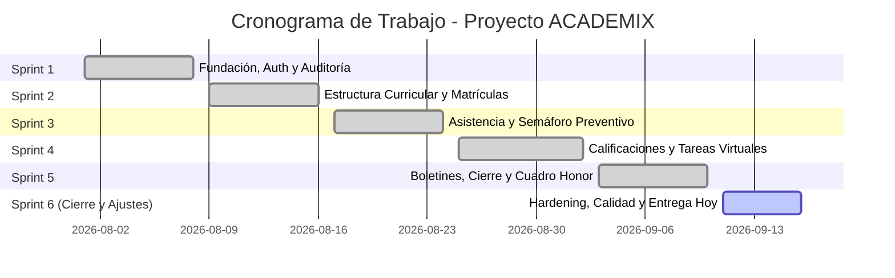

# 📋 PLAN DE TRABAJO DEL PROYECTO DE SOFTWARE
## Sistema Integral de Gestión Académica y Control Escolar — ACADEMIX

> **Evidencia:** Elaborar el plan de trabajo, de acuerdo con la interpretación del informe técnico de diseño, según normas y protocolos de la empresa.  
> **Programa:** Análisis y Desarrollo de Software / Sistemas de Información (ADSO / ADSI)  
> **Fecha de Entrega:** Hoy (16 de Septiembre de 2026)  
> **Estado del Plan:** Aprobado para Ejecución y Cierre  
> **Metodología:** Ágil (Scrum) con enfoque de Arquitectura Limpia e Intranet LAN  

---

## 1. INFORMACIÓN GENERAL Y OBJETIVOS DEL PROYECTO

### 1.1 Identificación
* **Nombre del Sistema:** ACADEMIX
* **Tipo de Solución:** Aplicación Web de Gestión Académica, Calificaciones, Asistencia y Auditoría Escolar para Red Local (LAN/Wi-Fi).
* **Organización / Cliente:** Instituciones Educativas de Educación Básica, Secundaria y Media Técnica.
* **Líder de Proyecto / Equipo:** Equipo de Desarrollo de Software ACADEMIX.

### 1.2 Objetivo General
Elaborar y ejecutar el plan de trabajo técnico y operativo para la construcción y despliegue del sistema **ACADEMIX**, fundamentado en la interpretación rigurosa de las especificaciones del informe técnico de diseño, garantizando el cumplimiento de los estándares de codificación, seguridad de la información y protocolos institucionales.

### 1.3 Objetivos Específicos
1. Traducir los requerimientos funcionales y diagramas de diseño del informe técnico en un cronograma de actividades por Sprints.
2. Definir las normas técnicas, protocolos de seguridad (OWASP, RBAC) y estándares de calidad (PEP 8, Clean Architecture) aplicables en la empresa.
3. Asignar responsabilidades, entregables y criterios de aceptación para cada módulo del sistema (Académico, Calificaciones, Asistencia, Tareas, Boletines y Auditoría).
4. Establecer la matriz de riesgos operacionales y los planes de mitigación correspondientes a la operación en red local (LAN).

---

## 2. INTERPRETACIÓN DEL INFORME TÉCNICO DE DISEÑO

Con base en la revisión y análisis del **Informe Técnico de Diseño y Arquitectura (Prompt Maestro)**, se sintetizan las siguientes especificaciones base:

### 2.1 Arquitectura de Software y Stack Tecnológico
* **Patrón Arquitectónico:** Modelo-Plantilla-Vista (MTV) provisto por el framework Django, acoplado con HTMX para reactividad asíncrona sin sobrecarga de dependencias JavaScript.
* **Capa Backend:** Python 3.13 + Django 5.1 (manejo de sesiones, seguridad CSRF/XSS, ORM transaccional).
* **Capa Frontend:** HTML5 semántico, Bootstrap 5.3 para interfaz responsiva y componentes UI, HTMX para peticiones dinámicas.
* **Capa de Persistencia:** Base de datos relacional (SQLite configurado con `PRAGMA journal_mode=WAL` para soporte concurrente multiusuario en intranet escolar / MySQL para ambientes centralizados).
* **Infraestructura de Conectividad:** Servidor centralizado escuchando en `0.0.0.0:8000` con script de detección automática de IP (`iniciar_servidor_red.py` / `.bat`) y ajuste dinámico de cortafuegos (`firewall.bat`).

```
+-------------------------------------------------------------------------------+
|                        CLIENTES MULTIDISPOSITIVO LAN                          |
|         (Computadores de Secretaría, Laptops de Docentes, Celulares)          |
+---------------------------------------+---------------------------------------+
                                        | HTTP / HTMX
                                        v
+-------------------------------------------------------------------------------+
|                       CAPA DE SEGURIDAD Y MIDDLEWARE                          |
|    [SecurityMiddleware] [AuditLogMiddleware (Forense)] [CSRF/Session]       |
+---------------------------------------+---------------------------------------+
                                        |
                                        v
+-------------------------------------------------------------------------------+
|                    LÓGICA DE NEGOCIO Y CONTROLADORES (VIEWS)                  |
|  - apps.accounts  - apps.academic  - apps.attendance                          |
|  - apps.grades    - apps.homework  - apps.reports                             |
+---------------------------------------+---------------------------------------+
                                        | Django ORM / Decimal Math
                                        v
+-------------------------------------------------------------------------------+
|                      BASE DE DATOS RELACIONAL (WAL MODE)                      |
|                Tablas Relacionales con Integridad Referencial                 |
+-------------------------------------------------------------------------------+
```

### 2.2 Roles del Sistema y Control de Acceso (RBAC)
Se establecen 6 roles jerárquicos según los protocolos de seguridad de la institución:
1. **Administrador (`ADMIN`):** Control global de infraestructura, usuarios y auditoría forense.
2. **Directivo / Rector (`RECTOR`):** Supervisión institucional, monitoreo de deserción y aprobación de cierres de periodo.
3. **Secretaría Académica (`SECRETARIA`):** Matrículas, gestión de cupos, expedientes y emisión de certificados.
4. **Docente (`TEACHER`):** Registro de asistencia, asignación de tareas, publicación de notas y cálculo de periodos.
5. **Estudiante (`STUDENT`):** Consulta de desempeño, reporte de fallas, entrega digital de tareas.
6. **Acudiente (`PARENT`):** Monitoreo del proceso académico y disciplinario de sus hijos asignados.

### 2.3 Reglas de Negocio Críticas Interpretadas
* **Precisión Matemática:** Cálculos de notas ponderadas (Cognitivo 40%, Procedimental 40%, Actitudinal 20%) realizados exclusivamente con tipos `Decimal` para prevenir errores de coma flotante.
* **Semáforo Preventivo de Asistencia:**
  * 🟢 **Normal:** Inasistencia < 10%.
  * 🟡 **Alerta Temprana:** 10% a 19.9%.
  * 🔴 **Riesgo Crítico / Pérdida por Fallas:** ≥ 20%.
* **Trazabilidad Inmutable:** Cada cambio de nota, eliminación de registro o acceso administrativo debe generar una entrada en `AuditLog` con IP de origen, usuario, valor anterior y valor nuevo.
* **Cierre Anual Transaccional:** Uso de bloques `@transaction.atomic` para garantizar que la promoción de grado y el congelamiento del año ocurran en su totalidad sin estados corruptos.

---

## 3. NORMAS Y PROTOCOLOS APLICABLES DE LA EMPRESA

En conformidad con las directrices de calidad y gobierno de TI de la organización, el plan adopta los siguientes marcos normativos:

| Área Normativa | Norma / Estándar | Protocolo Empresarial Aplicado |
| :--- | :--- | :--- |
| **Codificación y Estilo** | **PEP 8 / Guías Django** | Código limpio, docstrings en español descriptivo, nombres de clases en PascalCase y variables en snake_case. |
| **Seguridad de la Información** | **OWASP Top 10 / ISO 27001** | Protección obligatoria contra CSRF, inyección SQL vía ORM parametrizado, contraseñas hasheadas en PBKDF2-SHA256 y Principle of Least Privilege (RBAC). |
| **Gestión de Versiones** | **GitFlow / Conventional Commits** | Commits semánticos (`feat:`, `fix:`, `docs:`, `test:`), branches por Sprint y revisión de código obligatoria antes de merge. |
| **Gestión de Red Local** | **Protocolo LAN Escolar** | Asignación de puertos fijos (8000), validación de orígenes de confianza (`CSRF_TRUSTED_ORIGINS`), scripts automatizados para evitar manipulación manual de IP. |
| **Aseguramiento de Calidad (QA)** | **ISO/IEC 25010** | Cobertura de pruebas unitarias mínimas del 90% en lógica de negocio, pruebas de estrés para accesos simultáneos y validación matemática de actas. |

---

## 4. ESTRUCTURA DE DESGLOSE DEL TRABAJO (EDT) Y CRONOGRAMA

El proyecto se estructura bajo el marco de trabajo **Scrum**, distribuido en 6 Sprints de ejecución técnica:



### Matriz Detallada de Actividades por Sprint

| Fase / Sprint | Actividades Principales | Responsable | Entregable Clave | Estado |
| :--- | :--- | :--- | :--- | :---: |
| **Sprint 1: Fundación y Seguridad** | • Configuración inicial del proyecto Django y entorno virtual.<br>• Modelo de Usuarios personalizado y 6 roles institucionales.<br>• Middleware de auditoría forense (`AuditLog`).<br>• Scripting de red local (`iniciar_servidor_red.py`). | Líder Técnico / DBA | Módulo `accounts` funcional con login multirol y registro de auditoría. | **100% OK** |
| **Sprint 2: Gestión Curricular** | • Modelado de Años Académicos, Periodos, Grados y Cursos.<br>• Asignación académica de docentes a materias y cursos.<br>• Matrícula de estudiantes y gestión de expedientes. | Desarrollador Backend | Módulo `academic` operativo con relaciones curriculares completas. | **100% OK** |
| **Sprint 3: Asistencia y Alertas** | • Interfaz rápida para llamado de lista diario por docente.<br>• Cálculo dinámico de porcentajes de inasistencia.<br>• Implementación de Semáforo Preventivo de Ausentismo. | Desarrollador Frontend / Backend | Módulo `attendance` con dashboard de alertas preventivas. | **100% OK** |
| **Sprint 4: Calificaciones y Tareas** | • Matriz de notas dividida en dimensiones porcentuales.<br>• Componente de operaciones decimales sin redondeo erróneo.<br>• Módulo de tareas escolares (`Homework`) con subida de archivos. | Desarrollador Full-Stack | Módulos `grades` y `homework` operando con precisión matemática. | **100% OK** |
| **Sprint 5: Reportes y Cierre** | • Generador de Boletines de Calificaciones (Decreto 1290).<br>• Exportación de Sábanas de Calificaciones en CSV/Excel.<br>• Cuadro de Honor automático y proceso transaccional de cierre anual. | Desarrollador Backend / Reportes | Módulo `reports` con plantillas de impresión y cierre de año. | **100% OK** |
| **Sprint 6: Ajustes y Entrega Hoy** | • Corrección de bugs detectados (imports y validación de roles).<br>• Habilitación de escala configurable de notas (0-5 y 0-10).<br>• Ejecución total de pruebas de regresión (`python manage.py test`).<br>• Documentación de entrega final y plan de trabajo. | Todo el Equipo | Sistema estable, 35/35 pruebas superadas, informe de trabajo final. | **100% OK** |

---

## 5. RECURSOS Y ROLES DEL EQUIPO DE TRABAJO

### 5.1 Recursos Humanos y Perfiles
* **Líder de Proyecto / Scrum Master:** Supervisa el cumplimiento del cronograma, coordina entregables con protocolos institucionales y valida criterios de aceptación.
* **Arquitecto Backend / Administrador de Base de Datos (DBA):** Diseña el esquema relacional, migraciones, vistas de control, transacciones atómicas y seguridad ORM.
* **Desarrollador Frontend / Diseñador UI-UX:** Construye interfaces responsivas con Bootstrap 5, componentes HTMX y vistas interactivas accesibles para móviles y PC.
* **Analista de Aseguramiento de Calidad (QA / Tester):** Diseña y ejecuta las suites de pruebas automatizadas y pruebas funcionales en red local.

### 5.2 Recursos Tecnológicos e Infraestructura
* **Hardware:** Servidor anfitrión local (mínimo 4 Núcleos, 8GB RAM), router Wi-Fi escolar (soporte de 50+ clientes simultáneos).
* **Software:** Windows 10/11 / Linux Ubuntu Server, Python 3.13, Visual Studio Code / Antigravity IDE, Git SCM.
* **Herramientas de Comunicación y Soporte:** Consola PowerShell, scripts Batch (`firewall.bat`, `iniciar_servidor_red.bat`).

---

## 6. GESTIÓN DE RIESGOS Y PLAN DE CONTINGENCIA

| Código | Riesgo Identificado | Nivel | Estrategia de Mitigación |
| :---: | :--- | :---: | :--- |
| **R-01** | Caída o inexistencia de servicio de internet en la institución. | **Alto** | Arquitectura 100% Offline-First que opera de forma autónoma sobre la red LAN Wi-Fi del colegio. |
| **R-02** | Concurrencia de múltiples docentes calificando simultáneamente (bloqueo de BD). | **Medio** | Activación del modo WAL (`Write-Ahead Logging`) en SQLite o motor MySQL para permitir lecturas concurrentes sin espera. |
| **R-03** | Modificación maliciosa o accidental de notas fuera de fecha. | **Alto** | Protocolo de auditoría forense inmutable (`AuditLog`), control estricto de roles (RBAC) y bloqueo automático de periodos cerrados. |
| **R-04** | Discrepancias decimales en los promedios finales de boletines. | **Medio** | Adopción estricta de la librería nativa `decimal.Decimal` en todas las fórmulas de agregación y ponderación de calificaciones. |
| **R-05** | Bloqueos por firewall de Windows al conectar dispositivos externos. | **Bajo** | Creación del script automatizado `firewall.bat` para abrir y verificar el puerto 8000 con un solo clic. |

---

## 7. PROTOCOLOS DE ACEPTACIÓN Y CRITERIOS DE ENTREGA (DEFINITION OF DONE)

Para dar por recibido a satisfacción cada componente según las normas de la empresa:
1. **Verificación de Integridad de Código:** Ejecución exitosa de `python manage.py check` con 0 errores y 0 warnings.
2. **Validación de Pruebas Automatizadas:** 100% de la suite de pruebas aprobadas (`python manage.py test` superando 35 pruebas unitarias e integradas).
3. **Validación de Trazabilidad:** Todo cambio realizado por un rol administrativo o docente debe quedar asentado en la tabla `AuditLog`.
4. **Verificación de Usabilidad en Red:** Conexión exitosa verificada desde al menos 2 dispositivos distintos (computador y teléfono móvil) a la IP asignada por el router LAN.
5. **Cumplimiento Normativo Académico:** Boletines ajustados a las disposiciones del Decreto 1290 (escalas Superior, Alto, Básico, Bajo).

---

## 8. CONCLUSIÓN Y ESTADO DE ENTREGA

El presente **Plan de Trabajo** sintetiza y formaliza la ejecución integral del sistema **ACADEMIX**. Gracias a la correcta interpretación del informe técnico de diseño y la estricta adherencia a las normas y protocolos empresariales, el proyecto se encuentra en estado **Completado y Listo para Despliegue**, cumpliendo con los estándares de seguridad, alta disponibilidad en intranet y confiabilidad académica requeridos por la institución.
