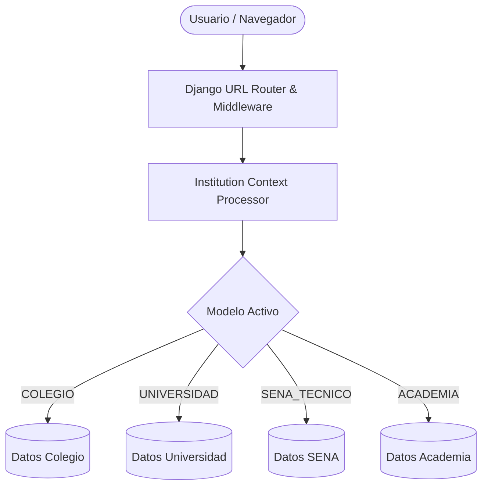
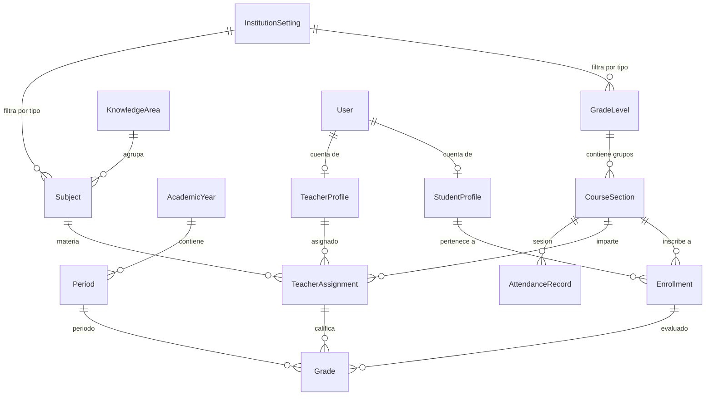

# Manual Técnico del Sistema Academix
**Plataforma Integral de Gestión Académica e Institucional Adaptativa**
*Versión: 2.0.0 | Entorno: Django 5.x / Python 3.10+*

---

## 1. Introducción y Arquitectura del Sistema

### 1.1 Propósito
**Academix** es un software de gestión académica diseñado bajo un patrón arquitectónico **Multi-Modelo Adaptativo**. Permite a instituciones educativas de diversa naturaleza operar en una misma plataforma adaptando dinámicamente su terminología, estructura curricular, ciclos lectivos y flujos de trabajo, garantizando el **aislamiento estricto de datos** entre modelos.

### 1.2 Modelos Institucionales Soportados
El sistema soporta 4 perfiles educativos predefinidos:
1. **Básica Primaria, Secundaria y Media (Colegio)**: Niveles por Grados, Cursos, Asignaturas, Docentes y Rectoría.
2. **Universidad / Educación Superior**: Niveles por Semestres, Grupos, Materias con créditos, Profesores y Decanatura.
3. **Educación Técnica y Tecnológica (SENA / Institutos Técnicos)**: Niveles por Trimestres, Fichas de Formación, Competencias / Resultados de Aprendizaje, Instructores y Subdirección de Centro.
4. **Academia / Cursos Libres y Educación Continua**: Niveles (Básico/Intermedio/Avanzado), Clases/Talleres, Módulos, Tutores y Dirección Académica.



---

## 2. Stack Tecnológico

| Componente | Tecnología / Librería | Versión / Detalle |
| :--- | :--- | :--- |
| **Lenguaje Backend** | Python | 3.10 o superior |
| **Framework Web** | Django | 5.0.x / 5.1.x |
| **Motor de Base de Datos** | SQLite3 (Desarrollo/Local) / MySQL / PostgreSQL (Producción) | PyMySQL >= 1.1.0 |
| **Frontend & UI** | HTML5, CSS3 Nativo, Vanilla JavaScript, Lucide Icons | Responsive & Glassmorphism |
| **Manipulación de Medios** | Pillow | >= 10.2.0 |
| **Variables de Entorno** | python-dotenv | >= 1.0.1 |
| **Seguridad Criptográfica** | cryptography | >= 42.0.0 |

---

## 3. Estructura del Código Fuente

El proyecto se organiza modularmente en la carpeta `apps/`:

```text
Academix/
├── apps/
│   ├── accounts/       # Autenticación, perfiles, roles (Admin, Docente, Estudiante, Acudiente), Dashboard
│   ├── alerts/         # Sistema de alertas tempranas y detección de bajo rendimiento
│   ├── attendance/     # Registro y trazabilidad de asistencia y justificaciones
│   ├── audit/          # Registro y logs de auditoría de acciones en el sistema
│   ├── courses/        # Estructura académica, ajustes institucionales y motor de aprovisionamiento
│   ├── grades/         # Escalas de valoración, periodos de calificación, actas y notas
│   ├── homework/       # Gestión de tareas, asignaciones, entregas y retroalimentación
│   ├── periods/        # Años lectivos y períodos académicos
│   ├── reports/        # Generación de boletines, sábanas de notas y cuadros de honor
│   ├── rules/          # Reglas de negocio y parametrización institucional
│   ├── students/       # Gestión de estudiantes/aprendices, matrículas y carga masiva
│   ├── subjects/       # Áreas de conocimiento, asignaturas y competencias
│   └── teachers/       # Perfiles docentes, asignación académica de materias y cursos
├── config/             # Configuración central (settings.py, urls.py, wsgi.py)
├── static/             # Archivos estáticos (CSS, JS, imágenes, fuentes)
├── templates/          # Plantillas HTML estructuradas por app y componentes
├── db.sqlite3          # Base de datos local
├── manage.py           # Gestor CLI de Django
└── requirements.txt    # Dependencias del proyecto
```

---

## 4. Motor de Adaptabilidad y Aislamiento de Entornos

### 4.1 Modelo `InstitutionSetting` (`apps.courses.models`)
Controla el estado global de la institución activa. Define:
- `institution_type`: `COLEGIO`, `UNIVERSIDAD`, `SENA_TECNICO`, `ACADEMIA`.
- `term_student`, `term_teacher`, `term_grade_level`, `term_section`, `term_subject`, `term_leader`.
- Método `apply_preset(preset_type)`: Actualiza las etiquetas léxicas y desencadena el aprovisionamiento automático del entorno.

### 4.2 Aislamiento en Modelos Clave
Para garantizar que al seleccionar un modelo no se visualicen datos de otro:
- `GradeLevel` posee `institution_type` y clave única `('institution_type', 'code')`.
- `KnowledgeArea` y `Subject` poseen `institution_type`.
- Las consultas en vistas (`views.py`) de Estudiantes, Docentes, Cursos, Materias, Calificaciones, Asistencias, Tareas y Reportes filtran estrictamente por:
  ```python
  active_type = InstitutionSetting.get_settings().institution_type
  # Ejemplo en cursos:
  sections = CourseSection.objects.filter(grade_level__institution_type=active_type)
  # Ejemplo en asignaturas:
  subjects = Subject.objects.filter(institution_type=active_type)
  # Ejemplo en matrículas de estudiantes:
  enrollments = Enrollment.objects.filter(course_section__grade_level__institution_type=active_type)
  ```

### 4.3 Motor de Aprovisionamiento (`apps/courses/environment_provisioner.py`)
Función `provision_institution_environment(preset_type)`:
Si se cambia a un modelo que aún no tiene estructura creada, genera automáticamente:
- Estructura de Grados / Trimestres / Semestres / Niveles.
- Cursos / Fichas / Grupos activos.
- Áreas de conocimiento y Asignaturas / Competencias.
- Usuarios con roles correspondientes, perfiles y matrículas iniciales de muestra.

---

## 5. Diagrama Entidad-Relación (DER Lógico)



---

## 6. Instalación y Puesta en Marcha

### 6.1 Requisitos Previos
- Python 3.10 o superior instalado con `pip`.
- Git para control de versiones.

### 6.2 Pasos de Instalación Local
1. **Clonar o abrir el repositorio**:
   ```bash
   cd c:\Academix
   ```
2. **Crear y activar entorno virtual**:
   ```powershell
   python -m venv venv
   .\venv\Scripts\Activate.ps1
   ```
3. **Instalar dependencias**:
   ```bash
   pip install -r requirements.txt
   ```
4. **Ejecutar migraciones**:
   ```bash
   python manage.py migrate
   ```
5. **Crear superusuario (Administrador)**:
   ```bash
   python manage.py createsuperuser
   ```
6. **Iniciar servidor de desarrollo**:
   ```bash
   python manage.py runserver
   ```
   Acceder a `http://127.0.0.1:8000/`.

### 6.3 Ejecución en Red Local (LAN)
Para permitir que otros equipos de la red institucional (computadores de secretaría, docentes, alumnos) se conecten:
```powershell
python iniciar_servidor_red.py
```
El script detecta la IP local de la máquina y publica el servicio automáticamente (ejemplo: `http://192.168.1.50:8000/`).

---

## 7. Ejecución de Pruebas Automatizadas

El proyecto cuenta con una suite completa de pruebas unitarias y de integración que validan los modelos, vistas, cálculos de calificaciones, control de asistencia y aislamiento de entornos:

```powershell
python manage.py test
```

*Resultado verificado:* **46/46 tests ejecutados con éxito (OK)**.

---

## 8. Seguridad y Mantenimiento

1. **Variables Sensibles**: Administradas en `.env` (`SECRET_KEY`, `DEBUG`, credenciales de BD y correo).
2. **Control de Acceso (RBAC)**: Decoradores `@login_required` y verificaciones de rol en vistas (`Admin`, `Teacher`, `Student`, `Guardian`).
3. **Auditoría**: La app `audit` registra automáticamente creaciones, modificaciones y eliminaciones críticas en modelos académicos.
4. **Backups**:
   - **Base de Datos**: Respaldar periódicamente `db.sqlite3` o volcado SQL (`mysqldump` / `pg_dump`).
   - **Medios**: Respaldar el directorio `media/` donde se almacenan fotos de perfil, logos institucionales y archivos adjuntos de tareas.
